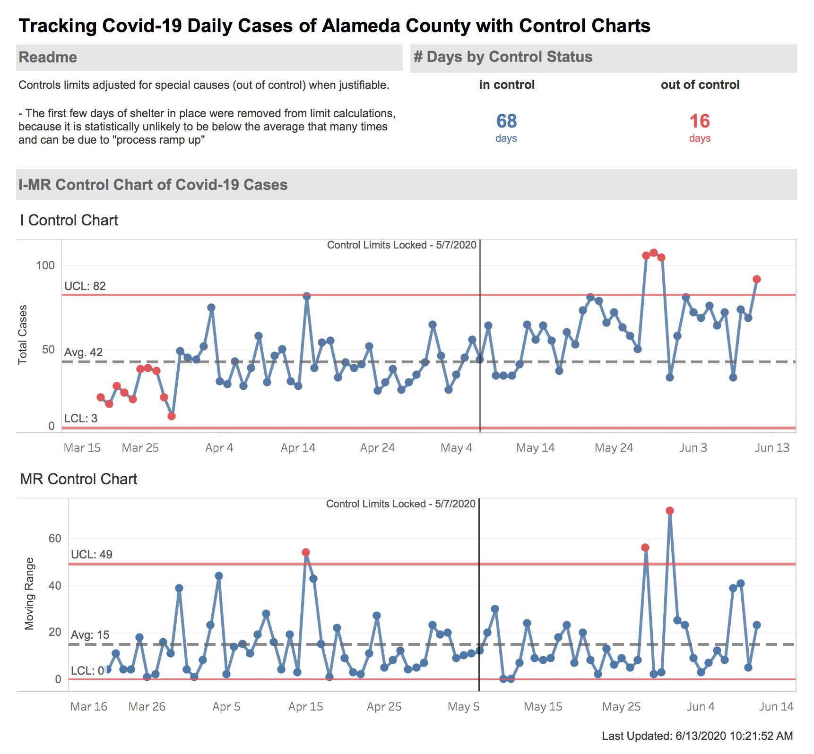

## Tracking Covid-19 case of Alameda County California using Statistical Process Control
[Link to Tableau Dashboard](https://public.tableau.com/profile/brenton.hsu5940#!/vizhome/AlamedaCountyControlChartCovid-19Cases/Overview?publish=yes)

## Intro
While watching the news on television, I saw the anchor display a trend graph of daily covid cases and describe the graph as if every spike and trend meant something. For example, the anchor would say that the "curve was flattening" or that we have "large spikes in cases". 

However, when I examined the graph, it looked like all the spikes and trends the anchor were describing could potentially just be common variances in the daily cases of covid-19 in Alameda County. This would mean that that spikes were not really signalling anything and that they are expected. This misinterpreation of spikes was concerning, because saying that a spike could lead viewers to panic and believe that covid-19 is getting worst in the county. 

In order to understand if the daily # of covid-19 cases were really putting out a signal to alameda county that the case counts were flattening or that the spikes meant an issue, I decided to analyze the data using control charts. Additionally, control charts have the potential benefits of being able to track if the expected # of daily cases are changing throughout the phases of Alameda County covid-19 response.

## Background on Control Charts
Control Charts are a graph and tool that tracks how a process is performing by accounting for the variance and averages in the data.

In each control charts, their are upper and lower limits that are calculated from the data. Any data point within these limits are known as common causes, which is the variance we expect from the process. Oppositely, any data point outside these limits are special causes and signals that something extremely different happened to that data point that caused it to be abnormally high or low. There are other ways to detect special causes by looking at the trends, but for this project we do not look at those yet. 

Based on the process of covid-19 daily cases, I decided to use a I-MR Chart. The I-MR Chart was selected, because the data cannot be subgrouped

## Data
The data was downloaded from Alameda County Open Data at this link [acgov link](https://data.acgov.org/datasets/AC-HCSA::alameda-county-covid-19-cases-and-deaths-over-time-1/data)

One major nuance is that the Alameda County total case count needs to add togther Berkeley and Alameda County total case counts, since their are consider different local health jurisdiction (LHJ)

### Assumptions
The main assumption of my analysis is that I assuming that Alameda County daily covid-19 is somewhat a stable process currently. I believe this to be true given that shelter in place order was initiated in March 19 and the data I have still falls in Phase 1. I expect the daily covid-19 cases to be a stable process in Phase I, because in theory everyone should be following the same process of sheltering in place. 

## Analysis
After cleaning and calculating the statistics needed for the control charts , the control charts were analyzed to determine what should Alameda County expectation be on daily cases.

Based on the control chart, the majority of the daily covid-19 cases in Alameda County should fall between 3 and 74 cases daily. As seen below, this mean the majority of the spikes are not really significant and should be expected by Alameda. In fact, their were only 2 days with high enough spikes to statistically signal that these days are ‘out of control’ and something has happened. Specifically, 4/3/20 and 4/15/20 had daily covid-19 cases above 74 cases. Based on this, I would recommend Alameda County to determine why these days had such high case counts to see if their is something that needs to be fixed of if these are one time events. 

Next steps generally would be to recalculate the control limits to get more accurate values on how many cases Alameda county should expect daily. However, since I am unable to determine the reason for the special causes, I left them in the calculation for the control limits. 

### Future Steps
In the future, I would like to do a deeper analysis on the trends to see if their are any additional special causes that could be affecting the control limit calculations. Adjusting the control limits for more special causes would generally give a more accurate picture on Alameda County expected # of cases and variance in them. 

Additionally, I plan on locking the control limits to see if the process and the control limits changes in each phase of Alameda Count responses to covid-19. 

##Recommendation 
Based on the control charts, I would recommend any viewer to not overreact to every spike in covid-19 cases they see. The spikes could simply be common variance and shouldn’t be interpreted as highly meaningful. For example, the viewer shouldn’t see a spike and expect that to indicate covid-19 cases are increasing, instead the viewer should see that spike as expected variation. 

Additionally, I recommend the control charts to be tracked to see if covid-19 daily expected cases are increasing or decreasing with each phase in Alameda County response to covid-19. The control limits would need to be recalculated if the # of daily expected covid-19 cases are actually changing. 

